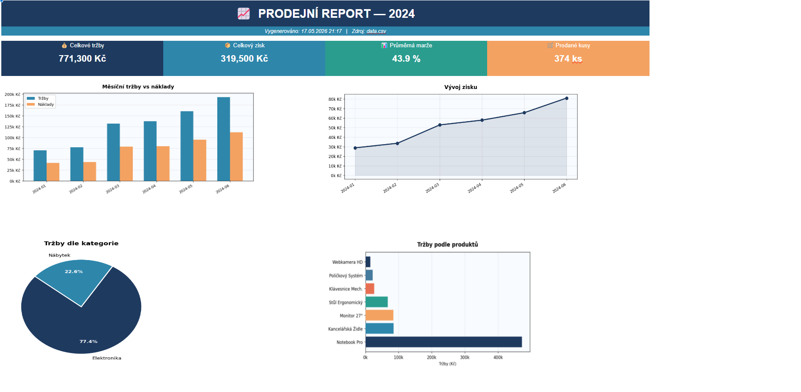

# 📊 Excel/CSV Report Generator

Automatically generates a visual HTML sales report from CSV data.

## What it does
- Reads sales data from a CSV file
- Calculates total revenue, profit, margin, and units sold
- Generates 4 charts: monthly revenue vs costs, profit trend, category breakdown, top products
- Exports everything as a clean HTML report

## Preview

## How to use
1. Install dependencies:
pip install pandas matplotlib

2. Place your CSV file in the project folder and rename it to `data.csv`

3. Run:
python report.py

4. Open the generated `report.html` in your browser

## CSV format expected
Your CSV should contain columns like: date, product, category, revenue, cost, quantity

## Built with
- Python
- Pandas
- Matplotlib
